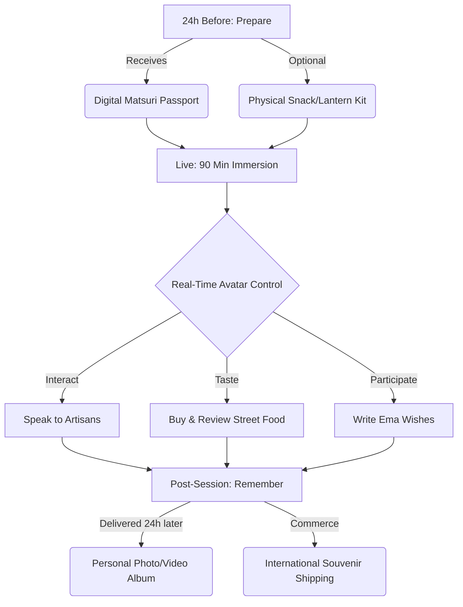

# 🏮 GENCHI Matsuri: Live Remote Festival Immersion


> **A product concept and interactive prototype built for the toraru CxO Internship Assignment (GS-JTI Program).**  
> **Concept & Development by:** [Shristi Rajpoot](https://github.com/Shristirajpoot)

---

## 📖 Executive Overview

**GENCHI Matsuri** is a product concept built on toraru's existing GENCHI telepresence platform. It aims to solve the **"Empathy & Accessibility Gap"** for the 100M+ international Japanophiles who want to experience Japan's 300,000+ annual festivals but face severe physical, visa, and financial barriers.

Instead of relying on passive YouTube videos or simulated VR, GENCHI Matsuri allows users to book a **90-minute live session** where they direct a real, trained human avatar physically present at a Japanese festival.

---

## 🔄 The User Journey Workflow



---

## 💻 System Architecture (Data & Streaming)

To scale globally with sub-500ms latency, the production architecture requires a robust integration of modern web frameworks, low-latency streaming, and AI pipelines.


---

## 📊 Revenue & Unit Economics

A scalable startup requires positive unit economics from day one. Below is the projected margin breakdown based on current gig-economy avatar labor costs.

| Package Tier | Price (¥) | Price (USD) | Avatar COGS | Margin | Features |
| :--- | :--- | :--- | :--- | :--- | :--- |
| **Standard** | ¥5,000 | ~$32 | ¥2,000 | **50%** | 90-min session, Photo album |
| **Premium** | ¥9,000 | ~$58 | ¥2,000 | **72%** | Standard + Physical Kit + Souvenir Shopping |
| **Annual Pass** | ¥36,000 | ~$230 | ¥8,000 | **72%** | 4 festivals/year, Priority matching |
| **Corporate** | ¥50,000+ | ~$320+ | ¥5,000 | **85%+**| Group streams, Custom team-building |

---

## ⚔️ Competitive Positioning

| Feature | YouTube / Streams | VR Tourism | GENCHI Matsuri |
| :--- | :---: | :---: | :---: |
| **Liveness (Happening Now)** | ❌ (Usually recorded) | ❌ (Simulated) | ✅ (Real-time) |
| **User Agency (Control)** | ❌ | ❌ (Pre-mapped) | ✅ (Direct the avatar) |
| **Cultural Participation** | ❌ | ❌ | ✅ (Write wishes, buy food) |
| **Human Connection** | ❌ | ❌ | ✅ (Live translated conversation) |

---

## 📂 Project Structure

```text
genchi-matsuri/
├── src/
│   ├── app/
│   │   ├── layout.tsx         # Global UI, Glassmorphism Nav & Footer
│   │   ├── page.tsx           # Home: Executive Summary & Assignment Rubrics
│   │   ├── experience/        # The 90-min Session Timeline
│   │   ├── market/            # Target Users & Virality Thesis
│   │   └── book/              # Interactive React Booking Form
│   └── globals.css            # Tailwind configuration & Base styles
├── public/                    # Static assets
├── tailwind.config.ts         # Design system tokens
└── README.md                  # Project documentation
```

---

## 🏃‍♂️ Run Locally

This project was bootstrapped with [`create-next-app`](https://github.com/vercel/next.js/tree/canary/packages/create-next-app).

1. Clone the repository:
   ```bash
   git clone https://github.com/Shristirajpoot/genchi-matsuri.git
   cd genchi-matsuri
   ```
2. Install dependencies:
   ```bash
   npm install
   ```
3. Run the development server:
   ```bash
   npm run dev
   ```
4. Open [http://localhost:3000](http://localhost:3000) in your browser.
